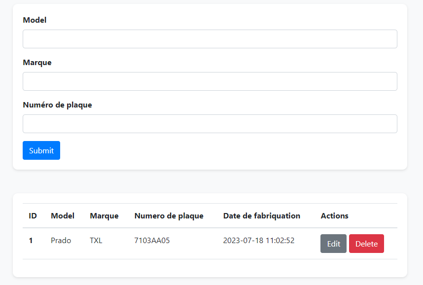

# Application Flask pour la gestion de données d'entreprise

Il s'agit d'une application web Flask pour la gestion de données d'entreprise stockées dans une base de données SQLite.

## Exigences

* Python 3.x
* Flask
* Flask_SQLAlchemy

## Configuration

1. Clonez ce dépôt sur votre machine locale.
2. Installez les paquets requis en utilisant la commande `pip install -r requirements.txt`.
3. Exécutez l'application en utilisant la commande `python app.py`.
4. Accédez à `http://localhost:5000` dans votre navigateur web pour utiliser l'application.

## Fonctionnalités

L'application offre les fonctionnalités suivantes :

* Ajout de nouvelles données d'entreprise à la base de données.
* Suppression de données d'entreprise de la base de données.
* Modification des données d'entreprise existantes dans la base de données.
* Affichage de toutes les données d'entreprise dans la base de données.
* Affichage d'une page d'accueil et d'une page "À propos".

## Utilisation

Pour ajouter de nouvelles données d'entreprise, remplissez le formulaire sur la page d'accueil et cliquez sur le bouton "Ajouter".

Pour modifier des données d'entreprise existantes, cliquez sur le bouton "Modifier" à côté des données sur la page d'accueil, apportez les modifications souhaitées, puis cliquez sur le bouton "Enregistrer".

Pour supprimer des données d'entreprise existantes, cliquez sur le bouton "Supprimer" à côté des données sur la page d'accueil.

Pour afficher toutes les données d'entreprise dans la base de données, accédez à la page d'accueil.

Pour afficher la page d'accueil ou la page "À propos", accédez aux URL correspondantes.

## Base de données

L'application stocke les données d'entreprise dans une base de données SQLite située dans un fichier nommé `database.db` dans le répertoire racine de l'application.

## Crédits

Cette application a été créée par Pinto Katende Jonathan.
